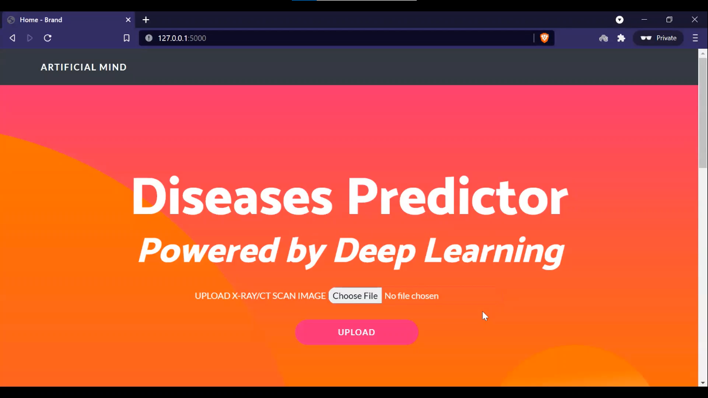
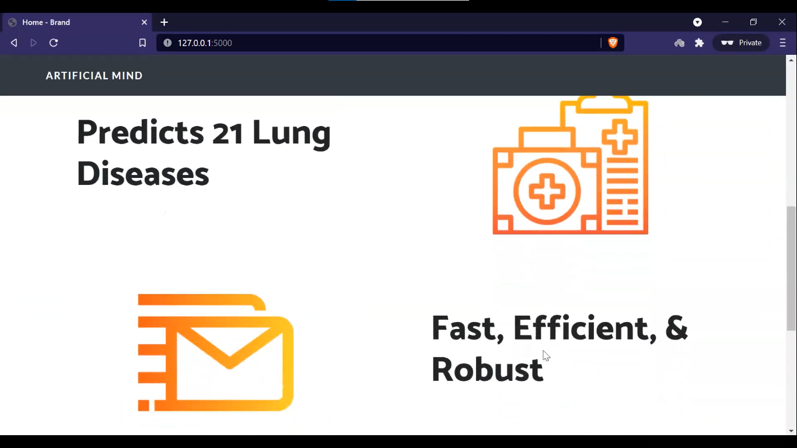
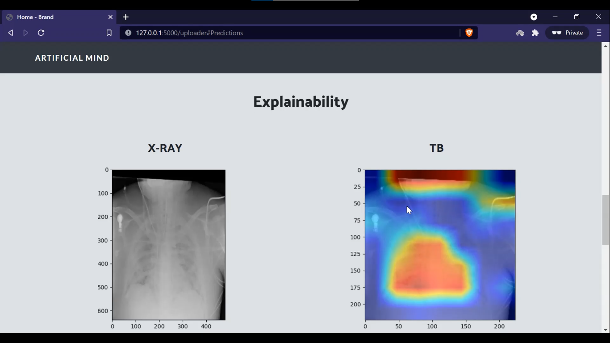

# AI for Healthcare Hackathon

This is the final submission for AI for Healthcare by Derbi Foundation from the Artificial Mind.

## Installation

Install the required libraries from requirements.txt

```bash
pip install -r requirements.txt
```

## Usage

```python
Run app.py
```
## Screenshots
|    |    |
| ---| ---|
||  |
||  |
   
## Team Members

[Aditya Bobde](https://github.com/Adi-19)  

[Shivam Tawari](https://github.com/shivamtawari)  

[Vishal Narnaware](https://github.com/vishalnarnaware)

## Contributions
Pull requests are welcome. For major changes, please open an issue first to discuss what you would like to change.

Please make sure to update tests as appropriate.

## License
[MIT](https://choosealicense.com/licenses/mit/)
